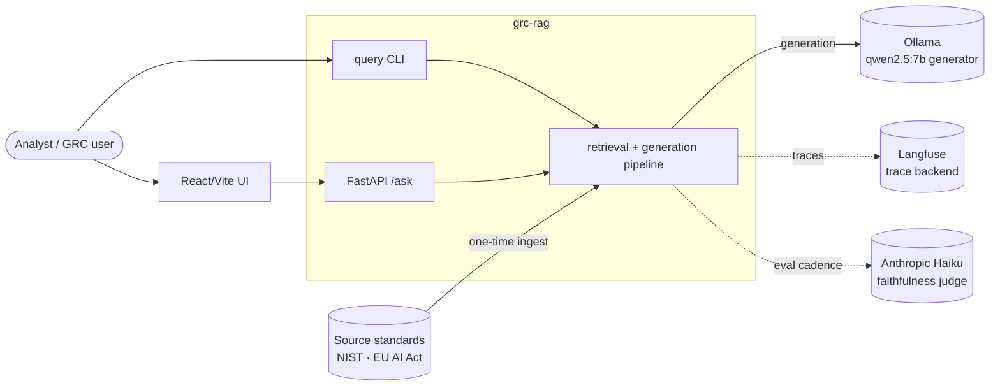

# Architecture

This document covers the shape of the system: its boundary, its components, the principles
that constrain it, and the quality attributes it is built to hit. The stage-by-stage data
flow with concrete data structures is in [03-data-flow.md](./03-data-flow.md). Each
significant decision has its own record under [adr/](./adr/).

## The two hard invariants

Everything else is a means to these two ends. They are recorded as decisions and are never
violated silently.

1. **Cite or refuse.** Every answer either carries inline citations to the source clauses it
   used, or it refuses with "Not supported by the corpus." A confident wrong citation is
   worse than no answer, so the system refuses when retrieval can't ground a claim. See
   [ADR-0001](./adr/0001-cite-or-refuse-invariant.md).
2. **Freely-redistributable corpus only.** The system indexes NIST AI RMF, the NIST GenAI
   Profile, and the EU AI Act. ISO/IEC 42001 is copyrighted, so its text is never ingested
   or shipped; only its clause identifiers are referenced. The exclusion is an allowlist
   with a deny-guard and a test, so shipping paywalled text is not possible by construction.
   See [ADR-0002](./adr/0002-corpus-licensing-as-code.md).

## System context



The generator is local, so per-query cost is effectively zero. The judge is the one cloud
dependency, and it runs on an evaluation cadence rather than in the request path. Langfuse
is an observability backend the system sends traces to; it orchestrates nothing.

## Components

One module per capability. Heavy or external dependencies sit behind small Protocol seams
(`Encoder`, `CrossEncoder`, `LLMClient`, `Retriever`, `Tracer`) so the pipeline is testable
with stubs and indifferent to which concrete model or backend is wired in.

```mermaid
graph TD
    subgraph ingest_phase[Ingest and index — one-time]
        ingest[ingest.py<br/>fetch · extract · clean · allowlist]
        structure[structure.py<br/>detect clauses, label segments]
        chunking[chunking.py<br/>700-token windows, 100 overlap]
        embeddings[embeddings.py<br/>MiniLM 384-dim, normalised]
        bm25[bm25.py<br/>BM25 lexical index]
        enforce_cal[enforce.py<br/>calibrate support threshold]
    end

    subgraph query_phase[Query — per request]
        hybrid[hybrid.py<br/>RRF fuse dense + BM25]
        rerank[rerank.py<br/>cross-encoder re-rank]
        enforce[enforce.py<br/>threshold gate]
        generate[generate.py<br/>cite-or-refuse + citation check]
    end

    subgraph eval_phase[Evaluation and operations]
        golden[golden.py<br/>hand-verified set]
        ir[ir_metrics.py<br/>recall@k · MRR · nDCG]
        judgemod[judge.py<br/>claim-by-claim faithfulness]
        evaluate[evaluate.py<br/>harness]
        tracing[tracing.py<br/>QueryTrace]
        percentiles[percentiles.py<br/>P50/P95 · cost]
        gate[gate.py<br/>CI regression gate]
    end

    ingest --> structure --> chunking
    chunking --> embeddings
    chunking --> bm25
    embeddings --> hybrid
    bm25 --> hybrid
    hybrid --> rerank --> enforce --> generate
    enforce_cal -.->|threshold.json| enforce
    golden --> ir
    golden --> judgemod
    ir --> evaluate
    judgemod --> evaluate
    evaluate --> gate
    generate -.-> tracing --> percentiles
```

| Capability | Module | What it does | Key choice |
|---|---|---|---|
| Ingestion | `ingest.py` | Fetch the standards, extract text (`pypdf` for NIST PDFs, `selectolax` for EUR-Lex HTML), clean it, and route every source through an allowlist guard. | Licensing enforced as code ([ADR-0002](./adr/0002-corpus-licensing-as-code.md)). |
| Structure | `structure.py` | Split text along its real boundaries (Articles, Annexes, RMF subcategories) and label each unit so citations resolve to a human clause, not an opaque index. | Heuristic anchors on heading form, no parser ([ADR-0003](./adr/0003-chunking.md)). |
| Chunking | `chunking.py` | Slide a 700-token window with 100-token overlap over each segment. `Chunk` is a frozen dataclass with full provenance. | Tokens, not characters; overlap so boundary sentences survive. |
| Dense embedding | `embeddings.py` | Encode chunks into 384-dim vectors with `all-MiniLM-L6-v2`, unit-normalised in our own code so cosine reduces to a dot product. The store is a numpy matrix. | No vector DB yet ([ADR-0004](./adr/0004-embeddings-no-vector-db.md)). |
| Lexical retrieval | `bm25.py` | A BM25 index over the same chunks, with our own tokeniser, so exact terms and clause numbers are matched where dense search is weak. | The keyword half of hybrid. |
| Hybrid retrieval | `hybrid.py` | Fuse dense and BM25 results by reciprocal-rank fusion (`k_rrf = 60`), using rank positions rather than incomparable raw scores. | RRF over score normalisation ([ADR-0005](./adr/0005-rrf-fusion.md)). |
| Re-ranking | `rerank.py` | Re-score the top candidates with a cross-encoder (`ms-marco-MiniLM-L-6-v2`) that reads query and chunk jointly. | Precision lift, and its score grounds the refusal gate ([ADR-0006](./adr/0006-rerank-threshold-enforcement.md)). |
| Refusal enforcement | `enforce.py` | Refuse before generation when the top re-ranked score is below a calibrated threshold (0.3325). | Calibrated from a probe set, fails closed on overlap ([ADR-0006](./adr/0006-rerank-threshold-enforcement.md)). |
| Generation | `generate.py` | Build the prompt, call the generator, extract citations, validate each against the retrieved set, and downgrade to refusal if none survive. | Citations verified, not trusted ([ADR-0007](./adr/0007-local-generator-citation-check.md)). |
| Prompts | `prompts.py` | Load prompt templates from files so they are versioned config, revisable under review without touching Python. | Versioned config ([ADR-0012](./adr/0012-prompt-versioning-tradeoff.md)). |
| Golden set | `golden.py` | The hand-verified question/answer key, keyed on stable clause labels and validated fail-fast on load. | Clause-label keys survive re-chunking ([ADR-0009](./adr/0009-golden-set.md)). |
| IR metrics | `ir_metrics.py` | recall@k, MRR, nDCG built by hand from the textbook formulae. Deterministic and keyless. | No sklearn; runs on every PR. |
| Judge | `judge.py` | The LLM-as-judge: decompose an answer into atomic claims and rule each against the cited chunks. | Claim-by-claim, not token overlap ([ADR-0008](./adr/0008-claim-by-claim-judge.md)). |
| Eval harness | `evaluate.py` | Run the full golden set end to end and aggregate IR, faithfulness, and refusal accuracy into one report. | Per-item judge errors are caught and counted, never abort the run. |
| Tracing | `tracing.py` | Wrap a query in timing and capture retrieved ids, scores, latency, and cost as a `QueryTrace`, shipped to Langfuse. | A `Tracer` seam; `NullTracer` by default ([ADR-0010](./adr/0010-observability-tracer-seam.md)). |
| Percentiles | `percentiles.py` | Compute P50/P95 latency and cost from traces in pure code. | Percentiles over averages — the tail is what users feel. |
| CI gate | `gate.py` | Threshold the eval numbers and exit non-zero on breach, split into a keyless tier and a paid tier. | Two-tier by cost ([ADR-0011](./adr/0011-two-tier-ci-gate.md)). |
| HTTP boundary | `api.py` | A thin FastAPI surface (`POST /ask`, `GET /health`) over the enforced pipeline, resolving citations to clause text at the edge. | Refusal is HTTP 200, citations resolved once ([ADR-0015](./adr/0015-fastapi-boundary.md)). |
| UI | `ui/` (React/Vite) | A standalone frontend that makes cite-or-refuse visible: citation chips, click-through clause text, a first-class refusal state, and a "how it answered" panel. | Refusal is first-class, not an error ([ADR-0016](./adr/0016-react-ui.md)). |

## Architecture principles

These hold across every module and are how the build stays defensible.

- **No RAG frameworks.** No LangChain, no LlamaIndex, no vector database. Every component is
  small enough to read and own. The reasoning is [ADR-0014](./adr/0014-no-frameworks.md).
- **One dependency per capability.** Each line in `pyproject.toml` maps to something built
  and explainable. The whole of Phase 2 added exactly one dependency (`rank-bm25`).
- **Immutable data, fail-fast validation.** Core types (`Chunk`, `Answer`, `GoldenItem`,
  `SupportThreshold`, `QueryTrace`) are frozen dataclasses. Bad input raises a `ValueError`
  with context rather than emitting silent garbage.
- **Seams, not direct imports, for heavy dependencies.** Models and backends sit behind
  Protocols so tests run with tiny stubs and never load a model, hit the network, or need a
  key.

## Quality attributes

What "good" means here, and how each is held to account.

| Attribute | How it's achieved | How it's checked |
|---|---|---|
| Faithfulness | Cite-or-refuse prompt + citation validation against the retrieved set. | Claim-by-claim judge; CI gate at ≥ 0.90 (`gate.py`). |
| Refusal correctness | Calibrated threshold gate before generation + zero-citation downgrade. | 5 of 5 out-of-corpus questions refused on the golden set. |
| Retrieval quality | Hybrid fusion + cross-encoder re-rank. | recall@10 gated at ≥ 0.85, deterministic, every PR. |
| Cost | Local embeddings and a local generator. | ~$0 per query; the judge runs on a cadence, not per request. |
| Latency | In-memory retrieval, small models on CPU. | P50/P95 from `percentiles.py` over recorded traces. |
| Legal safety | Allowlist + deny-guard on every ingest entrypoint. | A test asserts ISO is rejected; 0 lines of ISO text in the index. |

## Repository map

```
src/grc_rag/        the package — one module per capability (table above)
  prompts/          versioned prompt templates (cite-or-refuse v1/v2, judge prompts)
tests/              pytest suite — offline, stubs for every model and key
data/
  raw/              cached source standards (PDF / HTML)
  processed/        committed index: chunks.jsonl, embeddings.npz, index.jsonl, support-threshold.json
  golden/           golden-set.jsonl (41 items) + the seeded regression-set.jsonl
  eval/             scorecard.json — the committed judge result the gate reads
.github/workflows/  eval-gate.yml — the two-tier CI gate
ui/                 the React/Vite demo frontend (its own package, does not touch pyproject.toml)
docs/               this documentation
```
