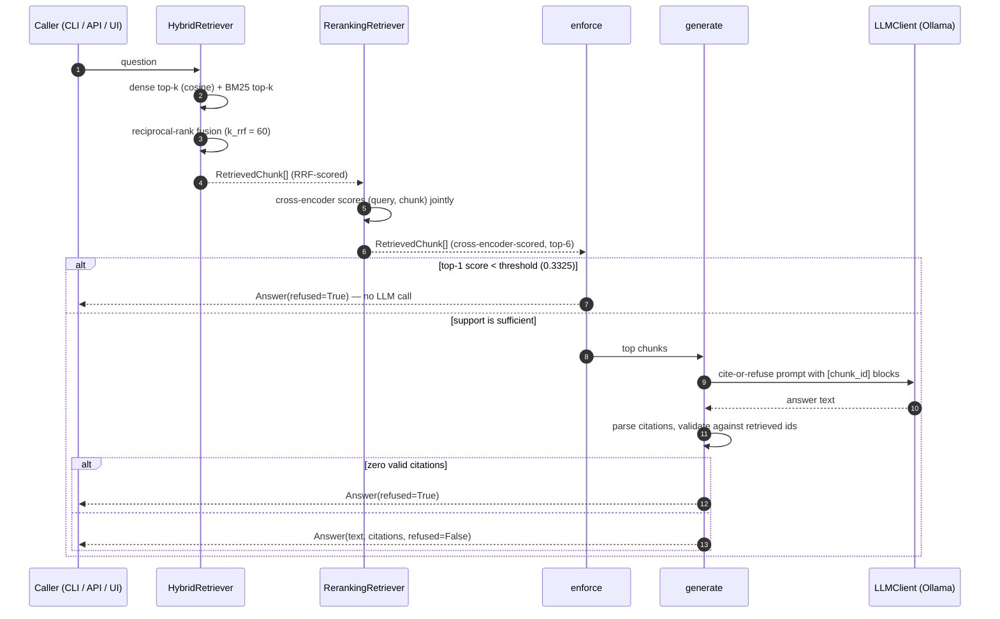

# Data flow

How data moves through the system, and the concrete structures handed from one stage to the
next. There are three phases: ingestion and index build run once and produce committed
artifacts; the query path runs per request. Component responsibilities are in
[02-architecture.md](./02-architecture.md).

## Phase 1 — Ingest and index (one-time)

This runs offline and writes the artifacts the query path reads. The processed index is
committed to the repo, so a fresh checkout can answer questions without re-ingesting.

```
source standards
   │  ingest.fetch_raw(SourceSpec)          # httpx, cached to data/raw/
   ▼
raw PDF / HTML bytes
   │  ingest.extract + clean_text           # pypdf / selectolax, drop furniture, reflow
   ▼
clean text per document
   │  structure.split_structured(doc_id)    # detect Articles/Annexes/RMF subcategories
   ▼
labelled Segment[]
   │  chunking.chunk_document               # 700-token windows, 100-token overlap
   ▼
Chunk[]  ──────────────►  data/processed/chunks.jsonl   (one Chunk per line)
   │
   ├─ embeddings.build_index               # all-MiniLM-L6-v2, unit-normalised
   │     ├──►  data/processed/embeddings.npz    (float32 matrix, N × 384)
   │     └──►  data/processed/index.jsonl       (chunks, row-aligned with the matrix)
   │
   └─ bm25.BM25Index.from_chunks           # lexical index over the same chunks

calibration (separate, from the probe set)
   enforce.calibrate_threshold(in_scores, out_scores)
      └──►  data/processed/support-threshold.json   {"value": 0.3325, "calibrated_on": ...}
```

Every ingest entrypoint passes through `_assert_allowed(doc_id)`, which raises unless the
source is on the allowlist (NIST AI RMF, NIST GenAI Profile, EU AI Act). The current index
is 450 chunks across the three documents, 76% of them clause-labelled.

## Phase 2 — Query (per request)



Two refusal points, by design. The threshold gate refuses cheaply, before any generation
call, when retrieval is too weak to ground an answer. The citation check refuses after
generation if the model produced no citation that resolves to a retrieved chunk. A
fabricated citation is dropped rather than trusted.

## Data structures between stages

These are the actual frozen types the code passes along. Field names are taken from the
modules.

| Stage boundary | Type | Carries |
|---|---|---|
| chunking → index | `Chunk` | `chunk_id`, `doc_id`, `text`, `token_count`, `start_token`, `clause_label` |
| embedding → store | numpy matrix + `index.jsonl` | float32, N × 384, unit-normalised; row *i* maps to chunk *i* |
| retrieval → re-rank | `RetrievedChunk` | the `Chunk` plus a fused RRF `score` |
| re-rank → enforce | `RetrievedChunk` | the `Chunk` plus a cross-encoder `score` |
| generation → caller | `Answer` | `text`, `citations` (tuple of validated chunk ids), `refused`, `prompt_version` |
| tracing → backend | `QueryTrace` | `question`, retrieved ids + scores, answer text, citations, `refused`, `prompt_version`, `latency_ms`, `cost_usd` |

A worked chunk id looks like `eu-ai-act::79`, which the CLI and API resolve to the human
label "EU AI Act — Article 5" before showing it. The mapping from chunk id to label lives in
the built index, so resolution needs no second retrieval.

## Two mechanisms worth understanding

**Reciprocal-rank fusion.** Dense cosine scores live in `[-1, 1]`; BM25 scores are an
unbounded sum. They are not comparable, so the system does not average them. RRF scores each
chunk by `Σ 1 / (k_rrf + rank)` across the two result lists, using only rank position. With
`k_rrf = 60` (the literature default), no single rank-1 hit dominates, and there is nothing
per-corpus to calibrate. In practice this is what fixed the Phase-1 over-refusal on EU AI
Act Article 5: the "prohibited" chunk that dense search ranked fourth is ranked first by
BM25, and fusion carries it into the top of the combined list. See
[ADR-0005](./adr/0005-rrf-fusion.md).

**Threshold calibration.** The refusal gate reads the top-1 cross-encoder score and refuses
below a fitted threshold. Calibration takes the in-corpus and out-of-corpus top-1 score
populations from a probe set and places the threshold in the gap between them. If the
populations overlap, calibration fails closed rather than picking an arbitrary cut. On the
cross-encoder scores the gap is wide (in-corpus scores well above zero, out-of-corpus well
below), which lands the threshold at 0.3325 and gives clean separation: 5 of 5 out-of-corpus
questions refuse, 5 of 5 in-corpus questions pass. The same separation does *not* exist on
the raw RRF scores, which is the concrete reason re-ranking has to come before the gate. See
[ADR-0006](./adr/0006-rerank-threshold-enforcement.md).

## Evaluation path

Evaluation reuses the same query path against the golden set instead of a live caller.

```
data/golden/golden-set.jsonl
   │  golden.load_golden_set            # validated fail-fast
   ▼
GoldenItem[]  (36 in_corpus + 5 out_of_corpus)
   │
   ├─ in_corpus  ─► run query ─► ir_metrics (recall@k, MRR, nDCG)
   │                          └─► judge.judge_faithfulness (claim-by-claim)
   └─ out_of_corpus ─► run query ─► refusal correctness
                                       │
                                       ▼
                                 EvalReport  ─► gate.evaluate_gate ─► pass / fail
```

The judge result is written to `data/eval/scorecard.json` with the date, the judge model,
the prompt version, and a SHA-256 of the golden file it was scored against. The per-PR gate
reads that scorecard so it never has to pay for the judge on every push, and it fails if the
card is stale or was measured against a different golden set. Details and numbers are in
[04-evaluation.md](./04-evaluation.md).
