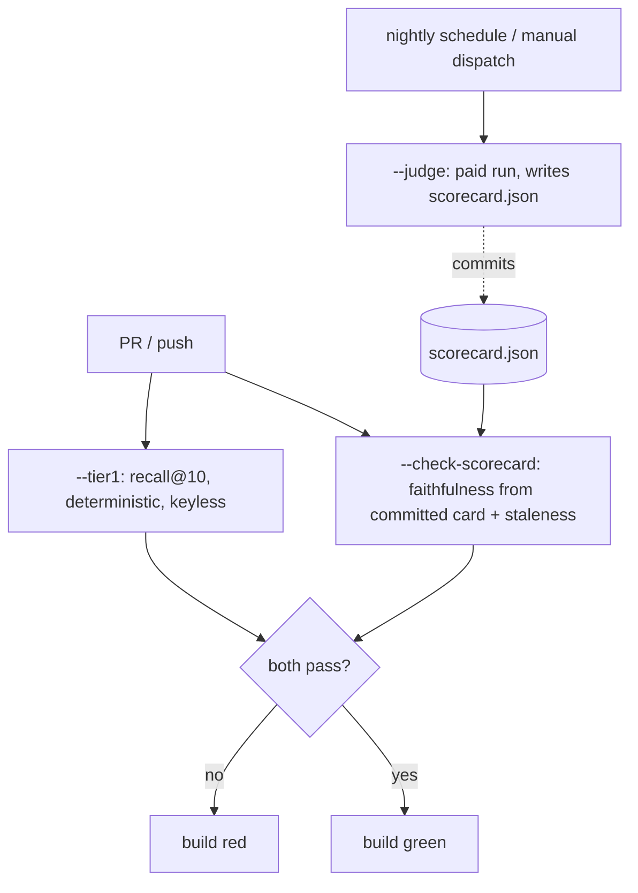

# Evaluation

The evaluation harness is what separates this system from a demo. A common shortcut is to
score faithfulness as token overlap between the answer and the context it was copied from,
which is close to 1.0 by construction and measures nothing. This system measures
faithfulness against the cited source, gates the build on it, and reports its misses
honestly.

## What gets measured

Three things, each kept separate.

- **Faithfulness** — for in-corpus answers, the fraction of atomic claims the cited chunks
  actually support.
- **Retrieval quality** — recall@10, MRR, and nDCG@10 over the golden set.
- **Refusal correctness** — for out-of-corpus questions, whether the system correctly
  refused.

## The golden set

41 hand-verified items: 36 in-corpus across 20 distinct clauses, plus 5 out-of-corpus. Each
in-corpus item names the clause that should ground the answer; each out-of-corpus item
expects a refusal.

Relevance is keyed on the stable `clause_label` ("EU AI Act — Article 3"), not the ephemeral
`chunk_id`. That means the answer key survives a re-chunk: change the window size and the
labels still resolve, where chunk ids would all shift. The set was drafted per clause and
then put through an adversarial verifier that checked each question against only its cited
clause text, which caught questions that merely restated their own clause's wording. The
loader validates every line fail-fast: a malformed item raises with its line number rather
than being skipped. See [ADR-0009](./adr/0009-golden-set.md).

A sample item:

```json
{"id": "g-eu-art3-1",
 "question": "Under the EU AI Act, what distinguishes a provider of an AI system from a deployer?",
 "kind": "in_corpus",
 "expected_doc": "eu-ai-act",
 "expected_clause_labels": ["EU AI Act — Article 3"],
 "schema_version": "golden/v1"}
```

## The faithfulness judge

The judge is a real LLM-as-judge, not a similarity score. For each answer it decomposes the
text into atomic factual claims and rules each one supported or unsupported against the
chunks that the answer cited. Faithfulness is supported claims over total claims. The prompt
explicitly forbids rewarding lexical similarity, and there is no token-overlap code path at
all: a test pins the behaviour by feeding an answer that echoes a chunk's exact words while
making an unsupported claim, and asserting it scores 0.0, not 1.0.

The judge runs as `claude-haiku-4-5-20251001` at temperature 0 behind the same `LLMClient`
seam the generator uses. Verdicts are strict JSON, parsed fail-fast. Determinism matters
because a judge that flaps cannot gate a build, so stability is itself measured by running
the judge several times at temperature 0 and reporting the score spread and per-claim
agreement. See [ADR-0008](./adr/0008-claim-by-claim-judge.md).

## IR metrics

recall@k, MRR, and nDCG@k are built by hand from the standard formulae, with no sklearn or
pytrec_eval. A retrieval hit is a chunk whose `clause_label` matches one of the item's
expected labels. These metrics are deterministic and need no key, which is what lets the CI
gate run recall@10 on every push.

## Results (2026-06-13)

Measured on the full golden set, hybrid retrieval into cross-encoder re-rank, local
qwen2.5:7b generator, Haiku judge at temperature 0.

| Metric | Target | v1 prompt | v2 prompt (current) | Gate |
|---|---|---|---|---|
| Faithfulness (judge) | ≥ 0.90 | 0.885 | **0.905** | pass |
| Recall@10 | ≥ 0.85 | 0.889 | **0.889** | pass |
| Out-of-corpus refusal | — | 5 / 5 | **5 / 5** | — |
| Answer relevancy | tracked | 0.917 | **0.722** | regressed |

The gate is green on the v2 prompt: faithfulness 0.905 clears 0.90, recall@10 0.889 clears
0.85.

## What worked

- The judge found genuine faithfulness gaps instead of rubber-stamping every answer at 1.0.
  That is the whole point, and it is the behaviour a token-overlap metric could never produce.
- Retrieval clears the recall bar against verified clause labels, not a hand-wave.
- The gate bites. It is unit-tested, and a seeded regression fixture (mislabelled golden
  data, routed in via an environment variable) collapses recall and turns the gate red on
  demand, then reverts.
- Refusal holds: 5 of 5 out-of-corpus questions refused, with no fabricated citation.
- Judge stability was a non-issue once the token budget was right (see below): zero parse
  errors across the 36 judged answers at temperature 0.

## What didn't, reported honestly

- **The v2 prompt traded relevancy for faithfulness.** Tightening cite-or-refuse to "leave
  it out if you are unsure" closed the faithfulness gap (0.885 → 0.905) but dropped answer
  relevancy from 0.917 to 0.722, because the generator now answers less fully. The
  faithfulness gain (+0.02) is small next to the relevancy loss (−0.20). The conclusion is
  that prompt-tuning alone cannot push both high on a local 7B model; a stronger generator
  is the real fix. v2 is kept because it meets the explicit faithfulness gate, with v1 one
  line away if relevancy is weighted higher. See
  [ADR-0012](./adr/0012-prompt-versioning-tradeoff.md).
- **"Zero uncited claims" turned out to be unsound as a gate metric.** It was in the
  original target list, but the structural reading (a sentence with no citation) measured
  formatting, not grounding: on real v2 answers it flagged 49 cases across 22 answers, almost
  all of them noise (enumerated legal lists cited once on the lead-in, colon lead-ins,
  question echoes). I built it, measured it, and dropped it rather than ship a metric that
  double-counts faithfulness. The property is already covered: cite-or-refuse holds by
  construction in `generate.py`, and whether a cited claim is supported is exactly
  faithfulness. See [ADR-0013](./adr/0013-drop-uncited-metric.md).
- **The first eval run crashed.** A many-claim faithfulness verdict overran the judge's
  1024-token budget, the JSON truncated, and the parse failure aborted the whole run. Fixed
  two ways: the judge's `max_tokens` is 4096 for eval, and the harness now catches per-item
  errors, counts them, and continues, so one bad verdict cannot discard a 40-item run.

## The CI gate

"Trust is measured" only means something if a quality drop fails the build. The constraint
is that the judge costs money and needs a key, so the gate splits by how each metric is
produced.



- **`--tier1`** computes recall@10 over the committed index and gates at 0.85. Keyless,
  deterministic, runs on every PR and push.
- **`--check-scorecard`** reads the committed `scorecard.json`, gates faithfulness at 0.90,
  and fails if the card is stale — older than the allowed age, or measured against a
  different golden set (it stores a SHA-256 of the golden file). Also keyless.
- **`--judge`** runs the paid judge, writes a fresh scorecard, and commits it. It runs only
  on a nightly schedule or manual dispatch, never on every push, so cost and the API key are
  never exposed on a fork's PR.

The honest tradeoff is that a PR is gated on the last committed faithfulness score, not a
fresh one. The staleness guard and the nightly refresh bound how old that can be. See
[ADR-0011](./adr/0011-two-tier-ci-gate.md).

## Pending

- A traced run to publish P50/P95 latency and cost-per-request from `percentiles.py`.
- A stronger generator to recover the v2 answer-relevancy regression without giving up the
  faithfulness gain.
